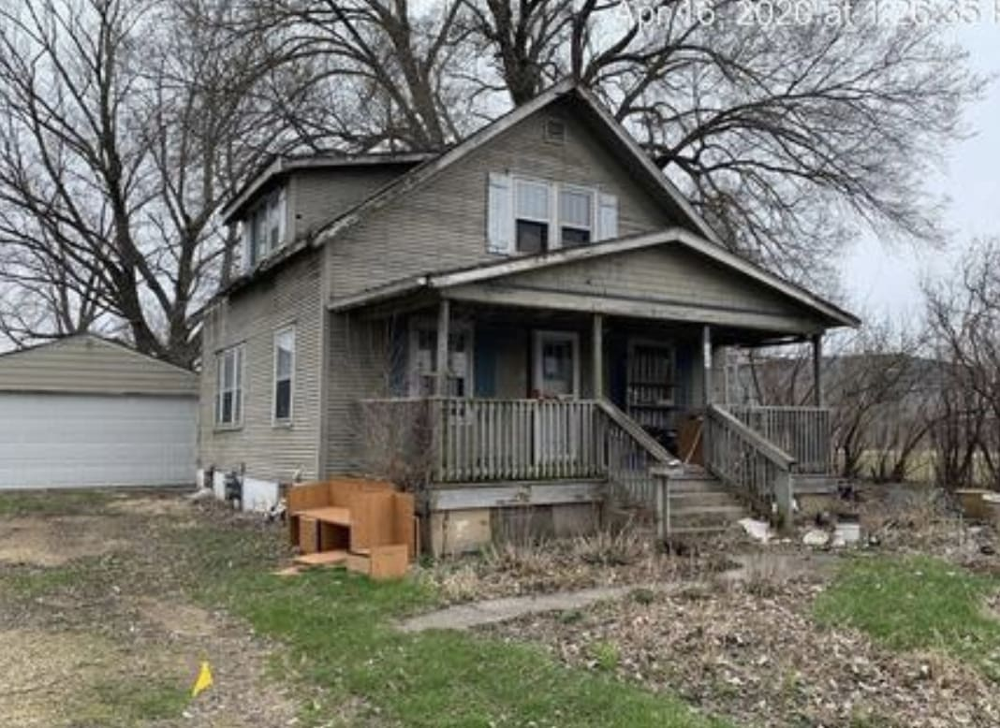
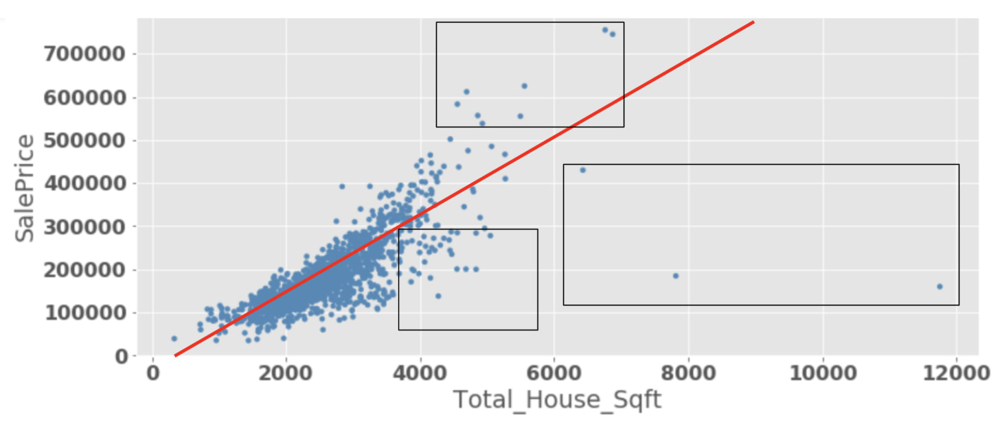
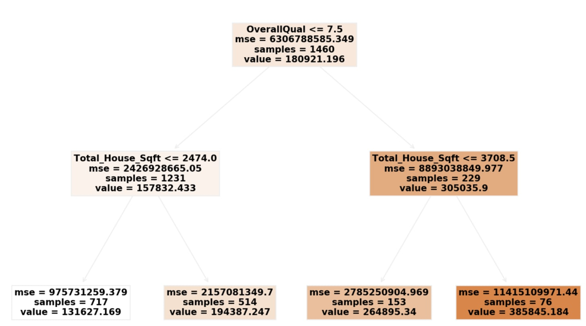

## Exercise 

I recently ran into a competition online to use a dataset from Ames, Iowa to predict the sale prices of houses given some information about them. This repository shows the outline of the process I applied to create a prediction model in an attempt to further my own understanding of Supervised Learning Algorithms.

*by J.DyBuncio*
*5/3/2020*

## Initial Approach

  

The picture above is a random photo I got after googling “Homes in Ames, Iowa.”

How much do you think this home would sell for?

Excluding the use of Zillow and the like, my process to answer this question went something like this:

* By Feel: I don’t know much about housing prices in general, but this house looks a bit old and dreary and is in Iowa. I would guess it is **$150k** since the lot looks pretty big, there are 2 floors, it is old, and in Iowa.

* By Average: The dataset I have for the competition I mentioned consists of 1,460 homes in Ames, Iowa who were sold between 2006-2010. The house from the photo is not in that dataset, but I figure the data is relevant enough to provide information I can use. The average sale price in this dataset is $181k, with the cheapest house sold for $35k and the most expensive for $755k. So I can update my answer to **$181k**.

* By utilizing one variable: While the average Sale Price in the dataset is $181k, there was also a wide range of different prices. Most houses fit between the range of $181k +/- $80k which feels pretty broad. One idea is the condition of this house looks to be below average. Luckily the dataset I have rates each house on a 1-10 scale based off of its “condition”. While I am not sure of the specifics of this rating, I can further inform my prediction by saying that this house feels like a 3/10 in terms of condition, and that the average Sale Price from a 3/10 house in the dataset I have happens to be **$102k**.

This process above speaks to the limits of what I could do prior to being exposed to some additional modeling techniques. The reason I would normally end here is because anything involving multiple variables gets more complex, not to mention 79 additional variables like I have in this dataset . $102k also seems like a pretty informed prediction so the question is how much do I actually gain for all the effort to untangle the added complexity?

I did the above totally blind to knowing the actual price of the home in the picture. It turns out the house from the picture is currently going for **$21,000**! The house in the picture above is on a 9,000 square foot lot, the house is 1,175 sq feet, but it was also built in 1916 and I guess is in way worse condition that I thought. If I had rated this home as a 1/10, then my informed guess would be updated to **$61k**.

## Applying some Supervised Learning Algorithms

I know of a couple people who have recently bought a home and have heard from them that there’s a lot that goes into buying one beyond its square feet, location, timing, and look. The dataset I am using has this level of detail and contains things such as the Land Contour (banked, flat, hillside, or depressed), the utilities available, the Zoning classification of the sale, and much more. The dataset I have is robust and is not realistic of one we would readily have for any city without significant effort. Luckily, a person by the name of Dean De Cock compiled it and it serves a strong foundation to build a prediction model which can account for several of the intricacies which go into a house’s Sale Price.

The edge of my abilities usually ended somewhere like the following graph shows. I could find which of the 72 variables, also known as “features,” are most correlated with Sale Price and then plot that one feature with Sale Price and hope for a linear relationship and plot a “best-fit” line.

  

The graph above would mean that I could take any house in Ames, Iowa and as long as I knew the house’s Square Footage, I could utilize the red trend line above to give a prediction of the House’s Sale Price. While this is informed relative to purely guessing, you can see how the trend line doesn’t capture the points highlighted in squares well. By only using this line, we are also ignoring the other 71 other features which may help us to make better predictions.

A reasonable thing to ask is why not, rather than draw a straight line, just connect all the dots in the graph and use that resulting squiggly line to predict housing prices. This underlines two central topics in prediction modeling: **1) The Train, Test Split** and **2) The Bias vs. Variance Tradeoff**.

* **The Train, Test Split**: I mentioned that this dataset comes from a competition. The competition allows one to download two datasets, one that is intended to create and train a model and then one that is used to test the model to evaluate how accurate it is on unseen data. They enforce this by not giving you the Sale Prices corresponding to the houses in the test dataset and they do the scoring for you. One simple way to think about this concept is that a prediction is only good insofar as it can predict outcomes for situations it has not seen before.

* **The Bias vs. Variance Tradeoff**: If I drew a squiggly line which connected all the points in the graph above, I could reach 100% accuracy relative to the training data, but what is to say the model would be accurate on unseen data? This speaks to a core tension whereby you want to create models which are accurate on the data you are using to train the model (i.e. low bias), but you also want your model to be general enough to be accurate on unseen, test data (i.e. low variance). The word ‘tradeoff’ is used because as one decreases bias, one eventually starts increasing variance and vice-versa.

Building off of the two concepts described above and also knowing that there must be some way to improve on the best fit line I had above, I ended up using five types of models to try to best create a prediction model: **Linear, Ridge, and Lasso Regression**, and a **Random Forest** and a **Gradient Boosting** model which uses Regression trees. While there is a good amount of Math behind these models, at their core are some basic concepts:

* Linear, Ridge, and Lasso Regression all stem from the same idea of fitting a linear line which minimizes the distance between the data points and the line. To account for more features, these models do the same thing in multi-dimensions. In the graph above, I had Sale Price vs. House Sq Footage. If I added a 3rd dimension, I could look at Sale Price vs. House Sq Footage and Total Rooms and fit a plane which best fits the data in 3 dimensions. I could keep adding features and dimensions. Above 3 dimensions, these regression models yield a fitted hyperplane to the data. The difference across these models is that Ridge and Lasso attempt to normalize the results in two different ways to penalize over-complexity and to minimize over-fitting to the training data.

* Random Forest and Gradient Boosting models can be used to help predict linear and non-linear data. The core concept is to split the data in such a way to yield an accurate prediction using Decision Trees. One path could be something like what is shown in the tree below.

  

* There are a lot of numbers, but the main things to see are that another way to split the data is by doing something like the tree above shows. We could start with all 1,460 houses who have an average Sale Price of $181k at the top, aka the root node. We then split based on if the Overall Quality of the house is rated above or below 7.5. That creates two branches below. At this level, each branch is then split based on how much Square Footage is in the house and then that yields a prediction as to the price of the house which is shown in the “Value” field at the bottom level. This is an example of one Regression Tree which has a max-depth of 2 (i.e. two sub-levels). Random Forest and Gradient Boost models fit and combine several Regression Trees which work through sets of features in order to minimize over-fitting. I won't go into these models' difference in this repo.
  
## Results

The evaluation below is relative to the Train-Test split I did to the Train dataset I had.

**My Data**

* I had data for 1,460 houses in Ames, Iowa.
* I split this data into 1,095 houses I would use to Train my models and 365 houses to Test my models.
* The 365 Houses who I will predict housing prices for have the following stats:
  * Avg Sale Price: $185k, Std Dev: $76k. Median: $173k

**Model Evaluation**

I used the Root Mean Squared Error (RMSE) between my predictions and the true Sale prices in the Test dataset to evaluate performance.

* Average: The average sale price in my Train data was $179k. This case represents using this avg value as my prediction for all 365 houses in the Test dataset. This is useful to create a baseline. Anyone in the world could come up with this prediction and we'd hope the subsequent models can beat it. RMSE = $76k

* Smarter Average: A slightly smarter approach is to take the average Sale Price by an important feature, for ex, Dwelling Unit, and use that against the Test set. There were 15 types of dwelling units in the data. I took the average Sale Price by Dwelling Type from the Training data and applied them to the Test data for my predictions. RMSE = $64k

* Linear Regression: RMSE = $34k

* Ridge Regression: RMSE = $32k

* Lasso Regression: RMSE = $32.5k

* Random Forest: RMSE = $34k

* Gradient Boosting: RMSE = $34k

The above shows that compared to this particular Train-Test split, my Ridge Regression model was the best at predicting this test set. It provided predictions which were an improvement of over half relative to using the average from the Training data. Also, Gradient Boosting and Random Forest models tend to perform better than Regression models since they can capture nonlinear effects and linear effects. Two hypothesis why these non-linear models didn't win in this case is: 1) The dataset is pretty small, I had only 1,000+ rows to train my model and these types of models usually require more data, especially in relation to the number of features I used due to one-hot encoding all categorical features. 2) I spent no time trying to tune these models while I did spend a good amount of time messing around with the Regression Models. For ex, I found that scaling my features ended up having a positive effect on my regression models. In future work, I would spend more time hypertuning my parameters and also doing a more exhaustive feature engineering process.

